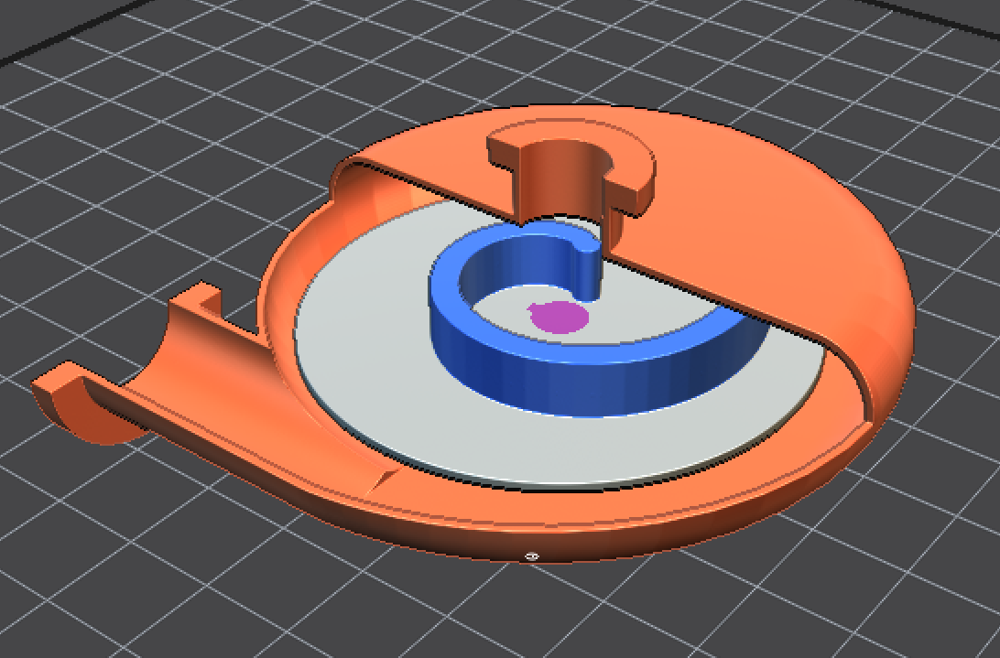
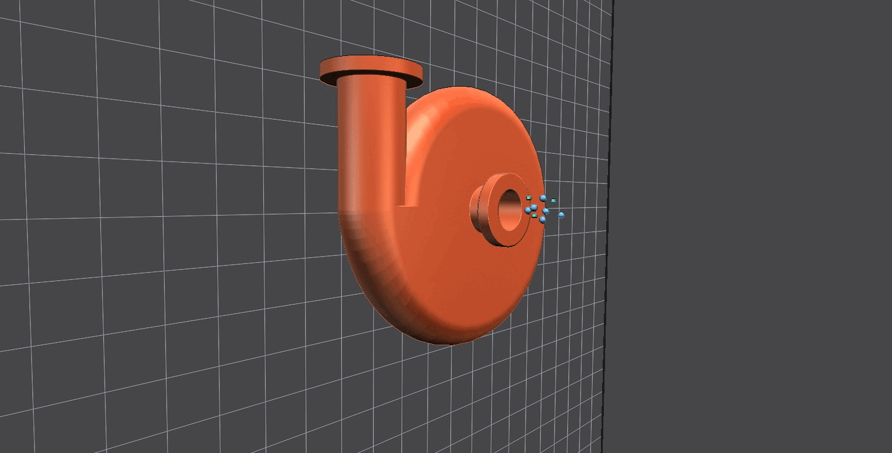
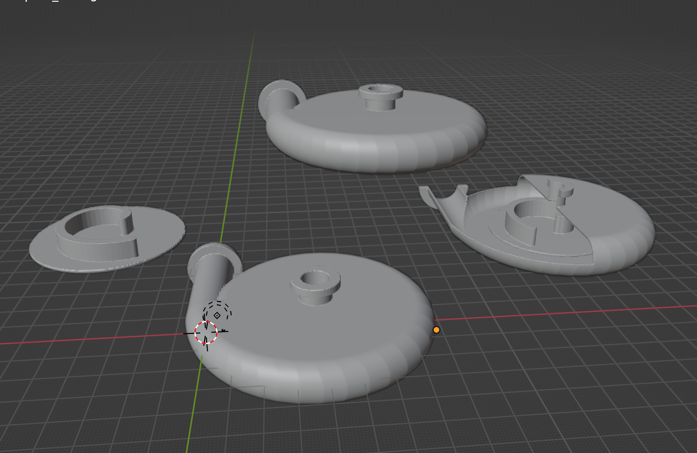
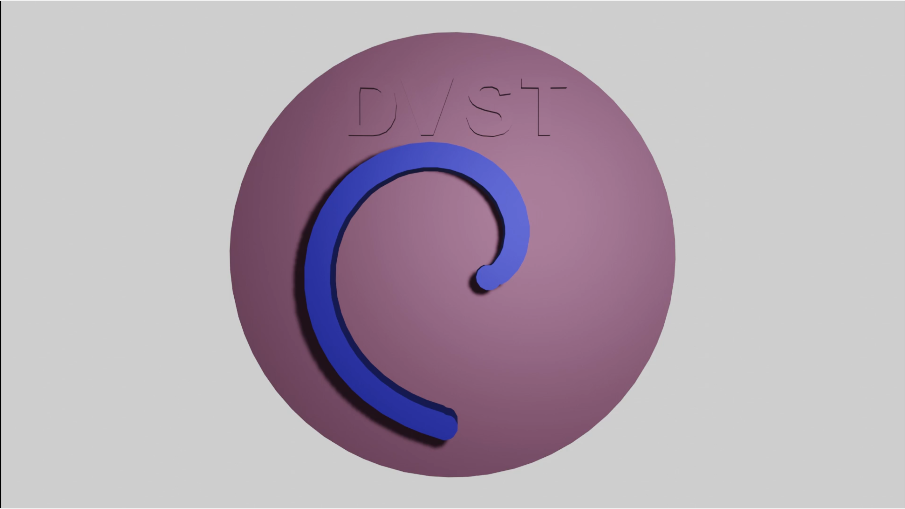

# 3D modeling in IceSL using Lua code

As a part of Additive manufacturing case study, a Centrifugal pump with semi-open single vane impeller was designed and developed in IceSL using Lua code.

Also detailed [documentation](Final_report.pdf) including its tutorial and video explaining its unique selling point is shared in this repo.

Youtube Video : https://youtu.be/6zw53zoakeU

Tutorial Video : https://youtu.be/jmPpKh3Y-70

### Final product 

### Working demo

### Components

### Prototype for 3D printing
